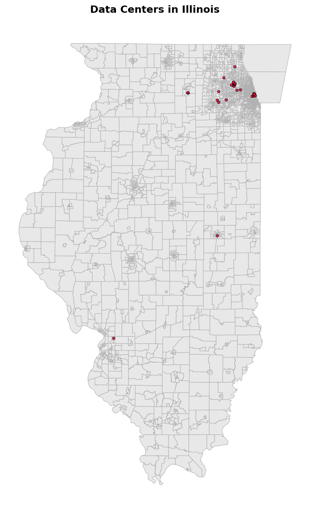
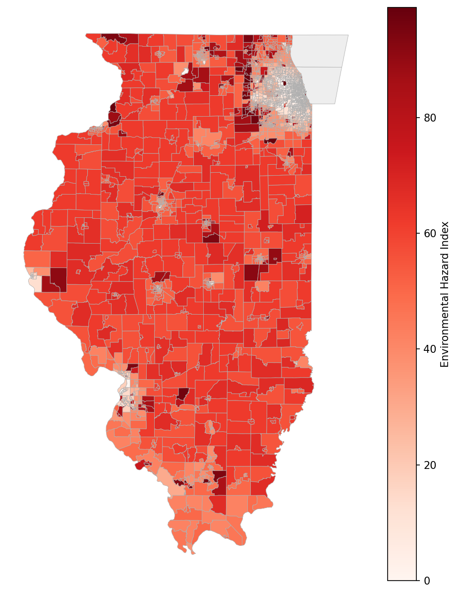
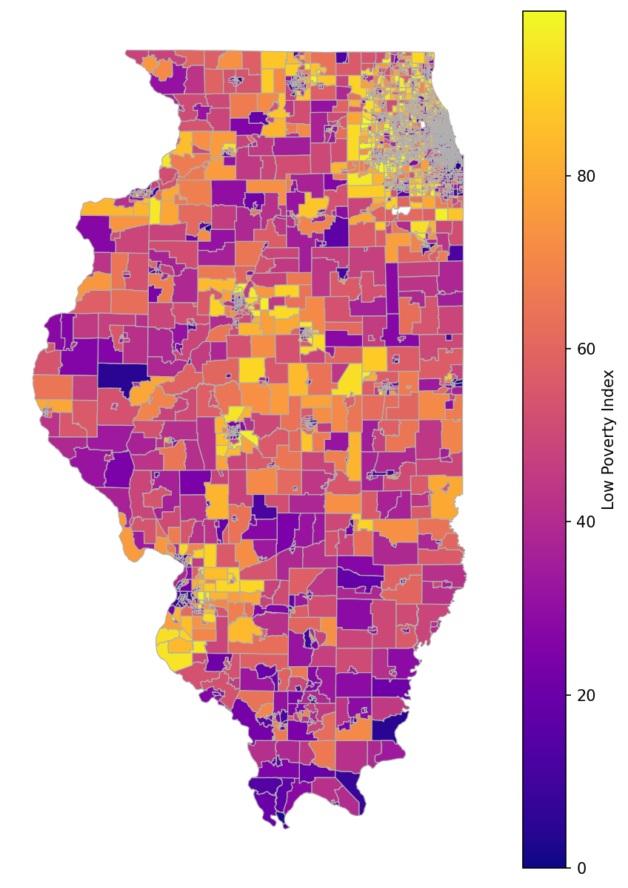

**Data Analytics and Visualization for Public Policy | MW 9:00AM – 10:20AM**

## Research Question

The rapid proliferation of data centers has raised growing concerns about their environmental and social footprints. This project investigates two related policy questions: (1) Are data centers in Illinois disproportionately sited in marginalized communities? (2) What is the environmental health profile of census tracts surrounding data centers? By combining spatial data on data center locations with census tract-level socioeconomic and environmental indicators, we assess whether the burden of data center infrastructure falls unevenly on vulnerable populations.

## Approach and Data

We used three primary data sources. First, U.S. Census tract boundary shapefiles provided the geographic foundation for our spatial analysis. Second, the Department of Housing and Urban Development (HUD) Affirmatively Furthering Fair Housing (AFFH) dataset provided census tract-level indicators including an environmental hazard index (based on pollution burden and population vulnerability), a poverty index, and a range of demographic variables. Third, the IM3 Open Source Data Center Atlas supplied geolocated data on existing data center facilities across Illinois.

We merged census tract with the HUD AFFH data on GEOID. All merging and reshaping was handled in code with no manual steps. Separately we had data center locations that we could plot on top of this cleaned and ready to use dataset.

## Challenges and Weaknesses

Data center definitions are inconsistent: the 170 facilities listed for Illinois range from 54 sq. ft. to over 200,000 sq. ft., spanning hyperscale campuses and small edge nodes. Much commercial data on data centers is paywalled for real-estate purposes, limiting our sample especially as it relates to size, owner, and operational status.

## Static Visualizations

### Figure 1: Data Center Locations across Illinois

This map plots data center locations in Illinois as red points overlaid on the state's census tract boundaries. The visualization makes clear that the overwhelming majority of data centers are concentrated in the Chicago metropolitan area and its immediate suburbs, with very sparse coverage across central and southern Illinois. This geographic clustering reflects both population density and the technology infrastructure in the Chicago region.

### Figure 2: Environmental Hazard Index and Data Center Co-location

This choropleth map shades each Illinois census tract by its HUD AFFH environmental hazard index score, a composite measure incorporating pollution burden (air quality, proximity to toxic sites, wastewater discharge) and population vulnerability. The visualization reveals that data centers are disproportionately clustered in census tracts with elevated hazard scores. This pattern is consistent with an environmental justice concern: communities already bearing high pollution burdens are more likely to host additional industrial infrastructure. The relationship is especially visible in Chicago's South and West sides, where multiple data centers coincide with the highest-scoring tracts. The hazard index encoding uses a diverging color scale.

### Figure 3: Poverty Index and Data Center Co-location

A third map shades census tracts by the HUD AFFH poverty index and overlays data center locations. The spatial pattern mirrors the environmental hazard finding: data centers are more commonly found in lower-income tracts, particularly within Chicago and its inner suburbs. This suggests that the communities least equipped to advocate against or negotiate benefits from new industrial siting are disproportionately hosting data center infrastructure. The poverty index encoding uses a diverging color scale.

## Streamlit App

Our interactive Streamlit application allows users to explore the relationship between data center siting and community characteristics in detail. Users can select from multiple demographic and environmental variables (e.g hazard index, poverty index, racial composition, and median household income) and the map updates dynamically to display the chosen variable as a choropleth layer with data center locations overlaid. Hovering over any census tract surfaces its data based on the chosen filter.

This interactivity adds value beyond what static plots can provide: users can zoom into the Chicago metro area to examine neighborhood-level variation, compare how different indicators correlate with data center presence, and investigate whether the pattern is driven by a handful of outlier tracts or is consistent across the distribution. Future extensions could expand coverage to other high-data-center states such as Virginia and Texas, add a time dimension as new facilities come online, and incorporate energy grid data to examine local power demand implications.

## Policy Implications

Our findings are consistent with environmental justice concerns: data centers in Illinois are more likely to be located in census tracts with higher pollution burdens and higher poverty rates. While this analysis cannot establish causation, the co-location pattern has real consequences. Data centers generate noise, cooling water demand, diesel backup generator emissions, and significant local grid load, adding cumulative burdens to already-stressed communities.

Policymakers could respond by requiring environmental impact assessments that explicitly evaluate cumulative burden when approving new data center permits, by conditioning substantial tax incentives on community benefit agreements, or by establishing buffer zones around tracts already above a pollution-burden threshold. Our Streamlit tool provides a ready-made decision-support interface for planners evaluating proposed siting locations against existing community vulnerability indicators.
